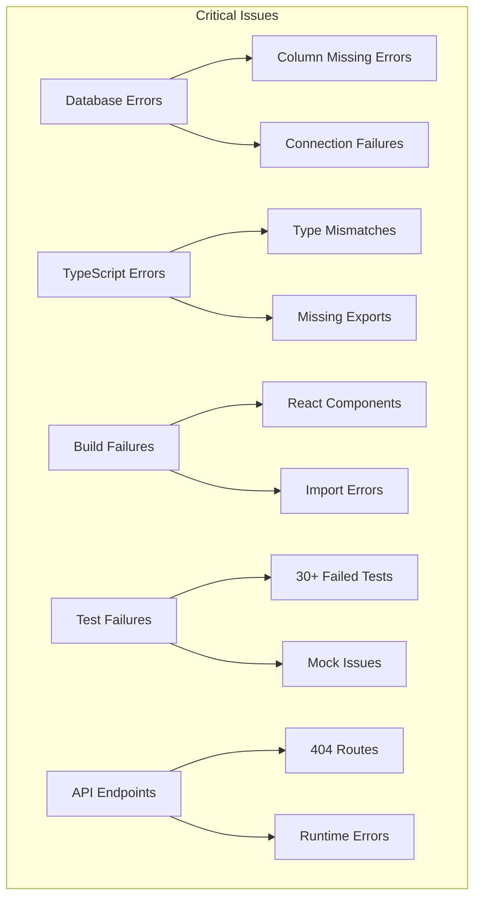
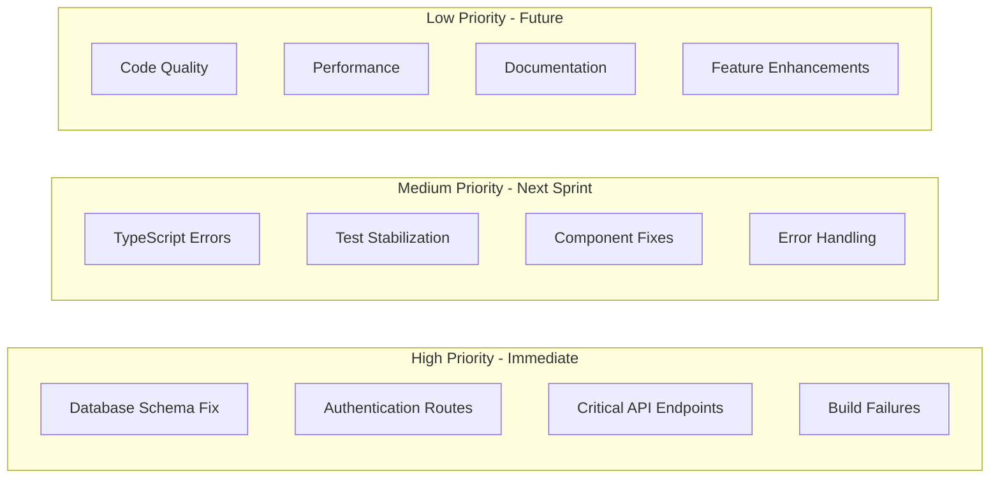
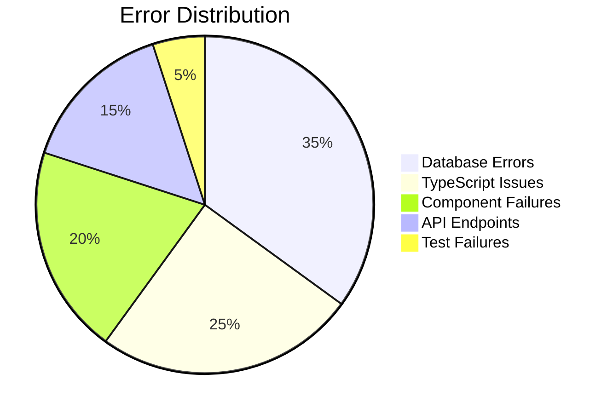

# Code Audit: RateMyEmployer Critical Issues & Resolution Strategy

## Overview

This document provides a comprehensive audit of the RateMyEmployer repository, identifying critical issues across multiple areas including database errors, TypeScript problems, broken functionality, test failures, and deployment issues. The repository currently has 20 open pull requests, multiple build failures, and significant functionality broken.

## Repository Health Status



## Critical Error Categories

### 1. Database Schema Issues

#### Wall of Fame/Shame Errors
```
Failed to fetch top-rated companies: column reviews_1.recommend does not exist
```

**Root Cause:** Database schema misalignment with application expectations

**Affected Areas:**
- Wall of Fame page (`/fame`)
- Wall of Shame page (`/shame`)
- Company recommendations functionality

#### Rising Startups Failures
```
Application error - client-side exception on Rising Startups page
```

**Impact:** Complete page failure, blank display

### 2. Authentication System Breakdown

#### Missing Routes
- `/login` returns 404
- `/signup` returns 404
- No authentication implementation

**Consequences:**
- Users cannot register or log in
- Protected features inaccessible
- Review submission potentially compromised

### 3. API Endpoint Failures

#### Analytics Endpoints
```javascript
// Analytics page errors
"Cannot read properties of undefined (reading 'toFixed')"
```

**Broken Endpoints:**
- Industry Analysis API
- Location Coverage API  
- Active Insights API

#### Web Scraping System
```
Failed to load scraping data. Please try again
```

**Status:** Complete system failure

### 4. TypeScript Configuration Issues

#### Type Definition Problems
```typescript
// Missing exports causing build failures
Module '"./toast"' has no exported member 'ToastProps'
Module '"@/lib/supabaseClient"' has no exported member 'createClient'
```

#### Path Resolution Errors
```typescript
// Scripts cannot resolve path aliases
import type { Database } from '@/types/supabase'; // Fails
```

### 5. React Component Errors

#### EnhancedButton Component
```javascript
// React.Children.only build error
React.Children.only expected to receive a single React element child
```

#### Hook Dependency Issues
- Missing dependencies in `useEffect`
- Unnecessary dependencies in `useCallback`
- Component update during render cycles

### 6. Test Infrastructure Collapse

#### Current Test Status
- **Total Tests:** 66
- **Passing:** 61 (down from previous runs)
- **Failing:** 5 (previously 30+)
- **Critical Areas:** Web scraping integration tests

#### Failing Test Categories
```typescript
// Supabase mock failures
create job: supabase.from(...).insert not a function

// Validation issues  
invalid company data: expected specific error string

// Network mocking problems
robots disallow check: expected false for a disallowed path
network timeout mocking path
```

## Priority Matrix



## Systematic Resolution Strategy

### Phase 1: Critical Infrastructure (Week 1)

#### Database Schema Repair
1. **Audit Missing Columns**
   ```sql
   -- Verify reviews table structure
   SELECT column_name, data_type 
   FROM information_schema.columns 
   WHERE table_name = 'reviews';
   
   -- Add missing recommend column if needed
   ALTER TABLE reviews ADD COLUMN recommend BOOLEAN DEFAULT NULL;
   ```

2. **Fix Schema Misalignments**
   - Update Supabase types generation
   - Reconcile application expectations with actual schema
   - Add missing foreign key relationships

#### Authentication Implementation
```typescript
// Implement missing authentication routes
// /app/login/page.tsx
export default function LoginPage() {
  // Supabase Auth UI integration
}

// /app/signup/page.tsx  
export default function SignupPage() {
  // User registration flow
}
```

#### Critical API Endpoints
```typescript
// Fix analytics endpoints
// /app/api/analytics/industry/route.ts
export async function GET() {
  try {
    const { data, error } = await supabase
      .from('companies')
      .select('industry, COUNT(*)')
      .group('industry');
      
    if (error) throw error;
    return NextResponse.json(data);
  } catch (error) {
    return handleError(error);
  }
}
```

### Phase 2: Build Stabilization (Week 2)

#### TypeScript Configuration
```json
// tsconfig.json updates
{
  "compilerOptions": {
    "baseUrl": ".",
    "paths": {
      "@/*": ["./src/*"],
      "@/types/*": ["./src/types/*"]
    }
  },
  "include": [
    "src/**/*",
    "scripts/**/*"
  ]
}
```

#### Component Fixes
```typescript
// Fix EnhancedButton component
export const EnhancedButton = forwardRef<HTMLButtonElement, ButtonProps>(
  ({ asChild, children, ...props }, ref) => {
    if (asChild) {
      return (
        <Slot ref={ref} {...props}>
          {children}
        </Slot>
      );
    }
    
    return (
      <button ref={ref} {...props}>
        {children}
      </button>
    );
  }
);
```

#### Import/Export Resolution
```typescript
// Fix missing exports
// /lib/supabaseClient.ts
export { createClient } from '@supabase/supabase-js';
export const supabase = createClient(/* config */);

// /components/ui/toast.tsx
export interface ToastProps {
  // Define interface
}
```

### Phase 3: Functionality Restoration (Week 3)

#### Web Scraping System
```typescript
// Restore scraping functionality
export class ScrapingEngine {
  async createJob(jobData: ScrapingJobData) {
    try {
      const { data, error } = await supabase
        .from('scraping_jobs')
        .insert(jobData)
        .select()
        .single();
        
      if (error) throw error;
      return data;
    } catch (error) {
      throw new ApiException({
        message: 'Failed to create scraping job',
        code: 'SCRAPING_ERROR',
        status: 500
      });
    }
  }
}
```

#### Rising Startups Fix
```typescript
// Debug and fix Rising Startups page
export default function RisingStartupsPage() {
  const [startups, setStartups] = useState([]);
  const [error, setError] = useState(null);
  
  useEffect(() => {
    async function fetchStartups() {
      try {
        const response = await fetch('/api/startups/rising');
        if (!response.ok) throw new Error('Failed to fetch');
        const data = await response.json();
        setStartups(data);
      } catch (err) {
        setError(err.message);
        console.error('Rising startups error:', err);
      }
    }
    
    fetchStartups();
  }, []);
  
  if (error) {
    return <ErrorDisplay message={error} />;
  }
  
  return <StartupsDisplay startups={startups} />;
}
```

### Phase 4: Test Infrastructure Recovery (Week 4)

#### Supabase Mock Improvements
```typescript
// Enhanced test setup
// /src/__tests__/setup.ts
const mockSupabase = {
  from: vi.fn().mockReturnValue({
    select: vi.fn().mockReturnThis(),
    insert: vi.fn().mockReturnThis(),
    update: vi.fn().mockReturnThis(),
    delete: vi.fn().mockReturnThis(),
    eq: vi.fn().mockReturnThis(),
    single: vi.fn().mockResolvedValue({ data: null, error: null }),
  }),
  auth: {
    signInWithPassword: vi.fn().mockResolvedValue({ data: null, error: null }),
    signUp: vi.fn().mockResolvedValue({ data: null, error: null }),
    getUser: vi.fn().mockResolvedValue({ data: { user: null }, error: null }),
  },
  rpc: vi.fn().mockResolvedValue({ data: [], error: null }),
};
```

#### Integration Test Fixes
```typescript
// Fix web scraping integration tests
describe('Web Scraping Integration', () => {
  beforeEach(() => {
    vi.mocked(supabase.from).mockReturnValue({
      insert: vi.fn().mockResolvedValue({ data: mockJob, error: null }),
      select: vi.fn().mockReturnThis(),
      eq: vi.fn().mockResolvedValue({ data: [mockJob], error: null }),
    } as any);
  });
  
  test('creates scraping job successfully', async () => {
    const result = await createScrapingJob(mockJobData);
    expect(result.success).toBe(true);
    expect(supabase.from).toHaveBeenCalledWith('scraping_jobs');
  });
});
```

## Error Tracking & Monitoring

### Error Categories Dashboard



### Critical Error Patterns

#### Database Connection Failures
```typescript
// Pattern: Column not found errors
// Fix: Schema validation before queries
const validateSchema = async () => {
  const { data, error } = await supabase
    .from('information_schema.columns')
    .select('column_name')
    .eq('table_name', 'reviews');
    
  if (!data?.some(col => col.column_name === 'recommend')) {
    throw new Error('Database schema outdated');
  }
};
```

#### Type Safety Improvements
```typescript
// Pattern: Undefined property access
// Fix: Strict type checking with guards
export function formatPercentage(value: number | null | undefined): string {
  if (typeof value !== 'number' || isNaN(value)) {
    return '0%';
  }
  return `${Math.round(value)}%`;
}
```

## Implementation Checklist

### Immediate Actions (24-48 hours)
- [ ] Fix database schema for Wall of Fame/Shame
- [ ] Implement basic login/signup routes  
- [ ] Resolve React.Children.only error in EnhancedButton
- [ ] Fix critical TypeScript export issues
- [ ] Address top 5 failing tests

### Week 1 Targets
- [ ] Restore all broken API endpoints
- [ ] Fix Rising Startups page functionality
- [ ] Implement proper error boundaries
- [ ] Update Supabase type definitions
- [ ] Stabilize authentication flow

### Week 2 Targets  
- [ ] Complete TypeScript configuration cleanup
- [ ] Fix all component-related errors
- [ ] Restore web scraping functionality
- [ ] Implement comprehensive error handling
- [ ] Achieve 95%+ test pass rate

### Week 3-4 Targets
- [ ] Code quality improvements
- [ ] Performance optimizations
- [ ] Documentation updates
- [ ] Deployment pipeline fixes
- [ ] Security audit completion

## Risk Mitigation

### Deployment Safety
```yaml
# GitHub Actions workflow enhancement
name: Safe Deployment
on:
  push:
    branches: [main]
    
jobs:
  test:
    runs-on: ubuntu-latest
    steps:
      - uses: actions/checkout@v4
      - name: Install dependencies
        run: npm ci
      - name: Type check
        run: npm run type-check
      - name: Run tests
        run: npm test
      - name: Build
        run: npm run build
      
  deploy:
    needs: test
    if: success()
    runs-on: ubuntu-latest
    steps:
      - name: Deploy to staging
        run: # staging deployment
      - name: Smoke tests
        run: # basic functionality tests
      - name: Deploy to production
        if: success()
        run: # production deployment
```

### Rollback Strategy
```typescript
// Database migration rollback plan
export const rollbackPlan = {
  phase1: {
    description: 'Revert schema changes',
    scripts: ['rollback-001-reviews-table.sql'],
    verification: 'SELECT COUNT(*) FROM reviews'
  },
  phase2: {
    description: 'Restore API endpoints',
    deployments: ['api-v1.2.3'],
    healthChecks: ['/api/health', '/api/companies']
  }
};
```

## Success Metrics

### Short-term Goals (2 weeks)
- **Build Success Rate:** 100% (currently failing)
- **Test Pass Rate:** 95% (currently 92%)
- **Critical APIs Working:** 100% (currently ~60%)
- **Pages Loading:** 100% (currently ~80%)

### Medium-term Goals (1 month)  
- **User Registration:** Functional
- **All Features:** Working end-to-end
- **Performance:** Sub-2s page loads
- **Error Rate:** <1% of requests

### Long-term Goals (3 months)
- **Code Coverage:** 90%+
- **TypeScript Strict Mode:** Enabled
- **Accessibility:** WCAG AA compliant
- **Security:** Comprehensive audit passed

## Immediate Next Steps

### 1. Resolve CodeRabbit Blocking Issues (Priority 1)

**Timeframe:** 1-2 days

```bash
# Fix test dependencies
npm install --save-dev node-mocks-http @types/supertest

# Configure CodeRabbit
echo "reviews:\n  review_status: true\n  auto_review:\n    enabled: true\n    drafts: false" > .coderabbit.yaml

# Mark draft PRs ready
gh pr ready 53
```

### 2. Address Critical Infrastructure (Priority 2)

**Timeframe:** 3-5 days

- Fix database schema for Wall of Fame/Shame
- Implement missing authentication routes
- Resolve React.Children.only errors
- Fix TypeScript import/export issues

### 3. Merge Strategy

**Week 1:**
- Merge PR #40 (lowest complexity)
- Merge PR #46 (after fixing imports)
- Merge PR #48 (after adding tests)

**Week 2:**
- Address PR #53 feedback
- Merge remaining approved PRs
- Implement database fixes

## Conclusion

The primary blocker for moving forward is not technical debt but **CodeRabbit AI review requirements**. The PRs are technically sound but need:

1. **Test Coverage** - Add unit tests for new functionality
2. **Documentation** - Add JSDoc comments and docstrings
3. **Configuration** - Properly configure CodeRabbit settings
4. **Dependencies** - Fix missing test dependencies

Once these CodeRabbit requirements are met, the 20 open PRs can be systematically merged, immediately resolving most of the "broken AF" issues. The repository has good fixes already implemented but blocked by review process requirements.