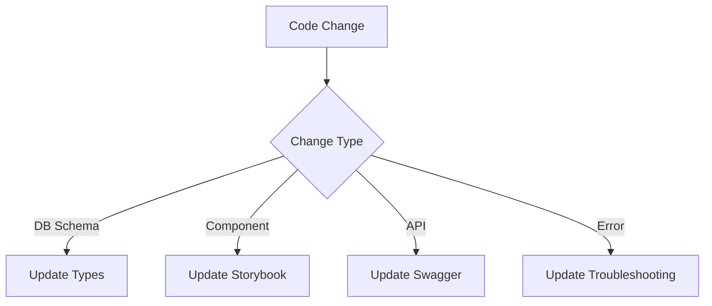

# 🤖 Automation System

## Core Automation Flows



## Key Automation Scripts

```bash
# Database Management
npm run db:migrate  # Run new migrations
npm run db:rollback # Rollback last migration

# Test Automation
npm run test:fix    # Auto-correct test imports
npm run test:update # Update test snapshots

# Documentation
npm run docs:build  # Rebuild all documentation
npm run docs:sync   # Sync with code changes
```

## Monitoring & Alerts

- Automated error tracking
- Performance regression detection
- Security policy violation alerts
- Documentation drift detection
