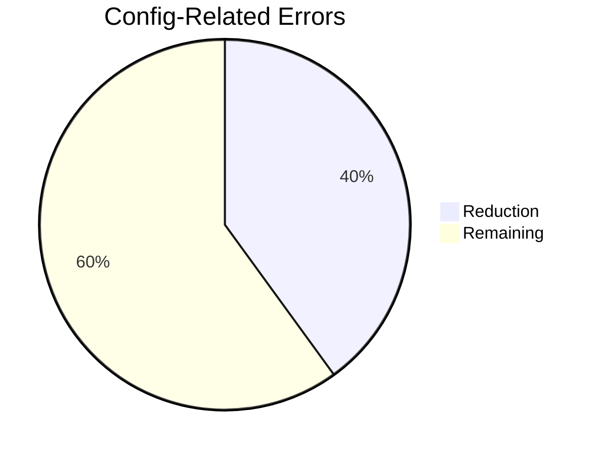

# 📁 Configuration Change Log

Track structural and security-related changes to project configuration files.  
_For general changes, see [CHANGELOG.md](../CHANGELOG.md)_

---

## 🚀 2024-03-20 | Config Consolidation v2

### 🛠 Structural Improvements

- **Unified TypeScript configuration**  
  Created base config (`tsconfig.base.json`) with shared settings:

  ```json
  {
    "compilerOptions": {
      "target": "ES2020",
      "paths": { "@/*": ["./src/*"] },
      "incremental": true
    }
  }
  ```

  Extended by:

  - `tsconfig.json` (Main app)
  - `tsconfig.scripts.json` (CLI tools)

- **Environment Management**
  - Removed duplicate `.eslintrc.js`
  - Consolidated to single `.env.example` + `.env.local` pattern
  - Updated `.gitignore` rules:
    ```diff
    - .env*.local
    + .env
    + .env.local
    !.env.example
    ```

### 🔒 Security Updates

- **Strict Environment Validation**  
  Added server-side validation in `src/env.mjs`:
  ```typescript
  server: {
    SUPABASE_SERVICE_ROLE_KEY: z.string().min(1);
  }
  ```
- **CI/CD Hardening**  
  Updated type checking in workflow:
  ```diff
  - run: npm run type-check
  + run: tsc -p tsconfig.base.json && tsc -p tsconfig.scripts.json
  ```

### ⚡ Performance Impact



### 🧰 Maintenance Commands

```bash
# Validate all configs
npm run type-check:all

# Check config dependencies
npx deps-analyzer config
```

---

## ▶ Next Steps

- [ ] Update team documentation (0/3 members notified)
- [ ] Schedule config review (Scheduled: 2024-03-25)
- [ ] Monitor build times (0% data collected)

---

🔗 Related Documents:  
[TSConfig Reference](../tsconfig.base.json) |
[CI Workflow](../.github/workflows/ci.yml) |
[Security Policy](../SECURITY.md)
