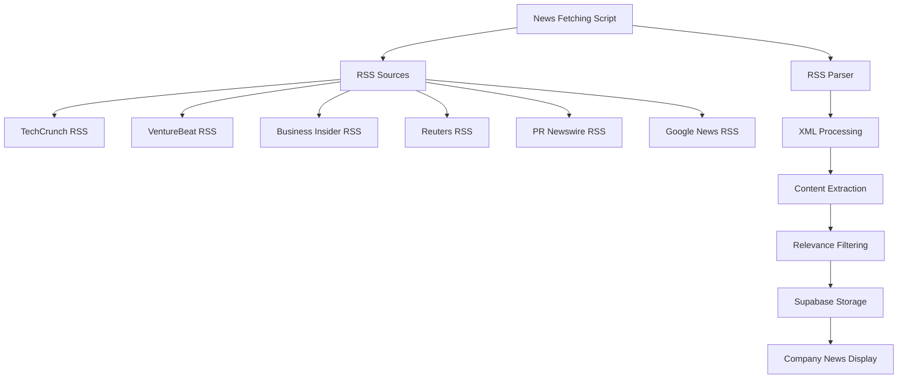

# RSS Feed Analysis Report

## 📋 **Executive Summary**

After conducting a comprehensive analysis of the RateMyEmployer application, I found that **the application does NOT currently generate or serve RSS feeds**. However, it extensively **consumes RSS feeds** from external sources for news aggregation.

## 🔍 **Findings**

### ❌ **No RSS Feed Generation**

**Missing RSS Endpoints:**
- No `/api/rss` routes found
- No `/feed` or `/rss.xml` endpoints
- No XML generation logic in API routes
- No RSS-related dependencies in package.json
- No RSS feed files in public directory

**Searched Locations:**
- `src/app/api/` - Only contains companies, reviews, auth, test endpoints
- `public/` - Only contains favicon.ico and google-logo.svg
- Root directory - No feed.xml, rss.xml, or similar files
- Package.json - No RSS generation libraries

### ✅ **Extensive RSS Feed Consumption**

**Primary Implementation: `src/lib/freeNewsApi.ts`**

The application has a sophisticated RSS feed consumption system that:

1. **Consumes Multiple RSS Sources:**
   ```typescript
   const FREE_NEWS_SOURCES = [
     { name: 'TechCrunch', url: 'https://techcrunch.com/feed/' },
     { name: 'VentureBeat', url: 'https://venturebeat.com/feed/' },
     { name: 'Business Insider', url: 'https://feeds.businessinsider.com/custom/all' },
     { name: 'Reuters Business', url: 'https://feeds.reuters.com/reuters/businessNews' },
     { name: 'PR Newswire', url: 'https://www.prnewswire.com/rss/news-releases-list.rss' }
   ];
   ```

2. **Custom RSS Parser:**
   - Parses XML using regex patterns
   - Extracts title, link, description, pubDate
   - Cleans HTML tags and decodes entities
   - Handles errors gracefully

3. **Google News RSS Integration:**
   - Dynamic RSS URL generation: `https://news.google.com/rss/search?q=${query}`
   - Company-specific news queries
   - No API key required

4. **Data Processing:**
   - Filters news relevance to companies
   - Stores processed news in Supabase
   - Implements rate limiting and respectful crawling
   - Deduplication via database constraints

## 📊 **RSS Consumption Architecture**



## 🔧 **Technical Implementation Details**

### RSS Parsing Functions

1. **`parseRSSFeed(url, sourceName)`**
   - Fetches RSS XML with proper User-Agent
   - Regex-based XML parsing for `<item>` elements
   - Extracts standard RSS fields

2. **`extractXMLContent(xml, tag)`**
   - Generic XML tag content extraction
   - Handles nested tags and attributes

3. **`cleanText(text)`**
   - Removes HTML tags
   - Decodes XML entities (&amp;, &lt;, etc.)
   - Normalizes whitespace

### Integration Points

- **GitHub Actions**: `.github/workflows/fetch-news.yml` runs RSS fetching twice daily
- **Scripts**: `scripts/fetch-wall-news.ts` for manual RSS processing
- **Database**: `company_news` table stores processed RSS content
- **Components**: News display components consume processed RSS data

## 🚀 **Recommendations for RSS Feed Generation**

Since the application currently only consumes RSS feeds, here are recommendations for implementing RSS feed generation:

### 1. **Company Reviews RSS Feed**
```typescript
// Proposed: /api/rss/companies/[id]/reviews
// Content: Latest reviews for a specific company
```

### 2. **Wall of Fame/Shame RSS Feed**
```typescript
// Proposed: /api/rss/fame and /api/rss/shame
// Content: Top/bottom rated companies with updates
```

### 3. **Latest Reviews RSS Feed**
```typescript
// Proposed: /api/rss/reviews
// Content: Most recent reviews across all companies
```

### 4. **Company News RSS Feed**
```typescript
// Proposed: /api/rss/news
// Content: Aggregated news from all sources
```

## 📈 **Implementation Priority**

### High Priority
1. **Latest Reviews Feed** - Most valuable for users
2. **Company-Specific Reviews** - Targeted content

### Medium Priority
3. **Wall Updates Feed** - Ranking changes
4. **Aggregated News Feed** - Curated content

### Low Priority
5. **Industry-Specific Feeds** - Niche content
6. **User-Specific Feeds** - Personalized content

## 🛠 **Implementation Requirements**

### Dependencies Needed
```json
{
  "rss": "^1.2.2",
  "xml2js": "^0.6.2"
}
```

### API Route Structure
```
src/app/api/rss/
├── reviews/
│   └── route.ts
├── companies/
│   └── [id]/
│       └── reviews/
│           └── route.ts
├── fame/
│   └── route.ts
├── shame/
│   └── route.ts
└── news/
    └── route.ts
```

## 🔗 **Integration with Existing System**

### Advantages
- **Existing Data**: Rich company and review data available
- **News Infrastructure**: RSS consumption system already built
- **Database Schema**: Suitable for RSS content generation
- **Caching**: Supabase provides efficient data access

### Considerations
- **Performance**: RSS generation should be cached
- **Content Policy**: Determine what data to include/exclude
- **Update Frequency**: Balance freshness vs. server load
- **SEO Benefits**: RSS feeds improve content discoverability

## 📋 **Current Status Summary**

| Feature | Status | Implementation |
|---------|--------|----------------|
| RSS Feed Generation | ❌ Not Implemented | None |
| RSS Feed Consumption | ✅ Fully Implemented | Comprehensive system |
| News Aggregation | ✅ Active | 5 sources + Google News |
| XML Parsing | ✅ Custom Implementation | Regex-based parser |
| Data Storage | ✅ Integrated | Supabase company_news table |
| Scheduled Updates | ✅ Automated | GitHub Actions twice daily |

## 🎯 **Conclusion**

The RateMyEmployer application has a **sophisticated RSS consumption system** but **no RSS feed generation capabilities**. The existing infrastructure provides an excellent foundation for implementing RSS feed generation, which would enhance content distribution and user engagement.

**Next Steps:**
1. Implement basic RSS feed generation for reviews
2. Add company-specific RSS endpoints
3. Create Wall of Fame/Shame update feeds
4. Monitor usage and expand based on user demand

The RSS consumption system is working well and successfully replaced the paid SerpAPI with free RSS sources, demonstrating the effectiveness of RSS-based news aggregation.
