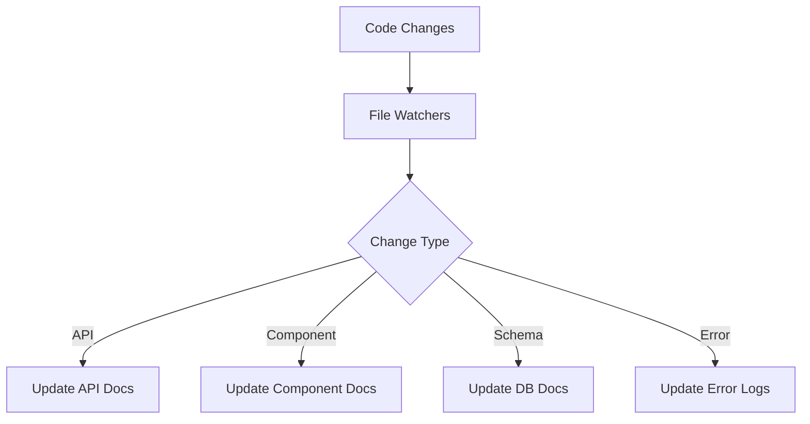
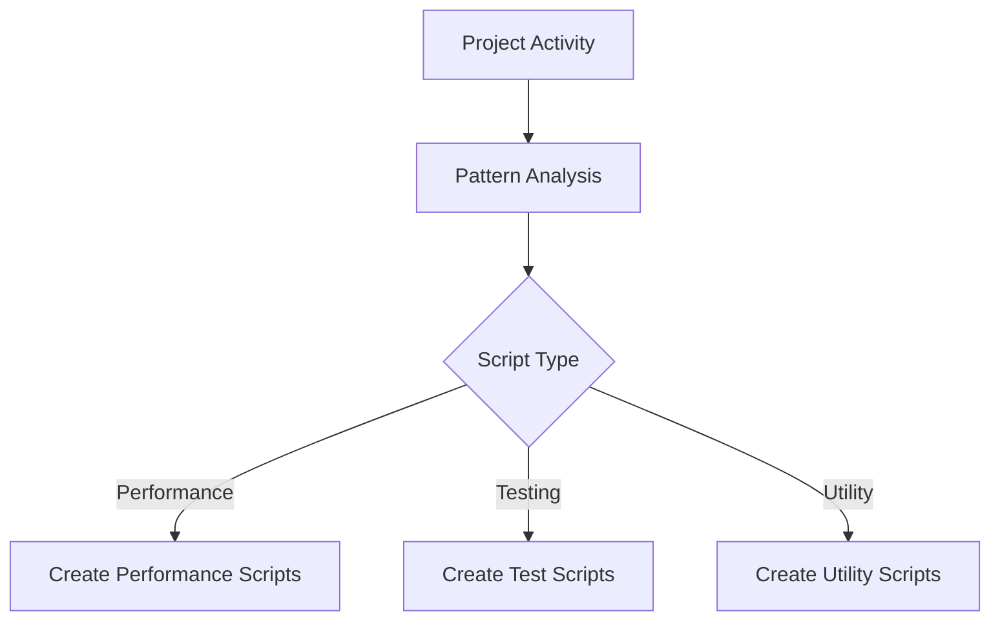
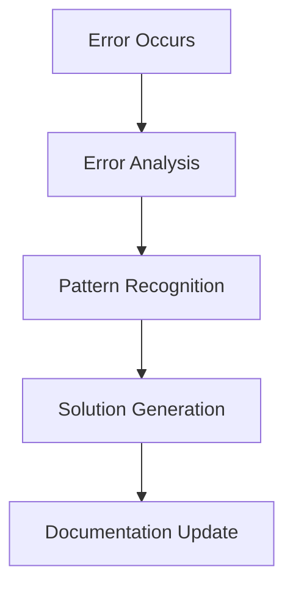

# 🤖 Project Automation & Documentation Guide

## 📚 Overview
This guide describes the automated systems that maintain, document, and optimize the Rate My Employer project. Our automation suite handles documentation updates, script generation, error tracking, and system health monitoring without manual intervention.

## 🎯 Design Philosophy
1. **Zero Manual Intervention**
   - Documentation stays current automatically
   - Scripts are generated based on patterns
   - Errors are tracked and documented
   - Solutions are automatically proposed

2. **Self-Improving**
   - Learns from development patterns
   - Adapts to team workflow
   - Evolves with the project
   - Optimizes based on usage

3. **Proactive, Not Reactive**
   - Anticipates common issues
   - Suggests optimizations
   - Prevents documentation drift
   - Maintains code health

## 🔄 Documentation Structure

### Core Documentation Files
```
docs/
├── PROJECT_GUIDE.md       # Main project documentation
├── SYSTEM_CHECKS.md       # Health monitoring and diagnostics
├── ERROR_SOLUTIONS.md     # Error tracking and solutions
├── AUTOMATION_GUIDE.md    # This file
└── DOCUMENTATION_HUB.md   # Entry point and navigation
```

### File Purposes

#### PROJECT_GUIDE.md
- Project overview
- Setup instructions
- Architecture details
- Development workflow
- Key features
- Best practices

#### SYSTEM_CHECKS.md
- Health check results
- Performance metrics
- Security audit logs
- Optimization suggestions

#### ERROR_SOLUTIONS.md
- Common error patterns
- Troubleshooting guides
- Solution database
- Prevention strategies

#### DOCUMENTATION_HUB.md
- Quick start guide
- Navigation hub
- Available commands
- Recent updates

## 🔄 Automation Systems

### 1. Documentation Automation
Automatically maintains all project documentation:



### 2. Script Generation
Creates and updates utility scripts based on project needs:



### 3. Error Management


## 🛠️ Implementation

### Base Configuration
```typescript
// scripts/auto-generate-config.ts
export const config = {
  documentation: {
    updateTriggers: ['commit', 'build', 'error'],
    templates: './resources/templates',
    output: './resources'
  },
  scripts: {
    generators: ['test', 'performance', 'utility'],
    output: './scripts',
    naming: 'kebab-case'
  }
}
```

### Git Hooks Integration
```bash
#!/bin/sh
# .husky/pre-commit

# Run documentation updates
npm run update-docs

# Add updated files
git add docs/*.md

# Run checks
npm run check
```

### CI/CD Integration
```yaml
name: Update Documentation
on:
  push:
    branches: [main]
  pull_request:
    branches: [main]

jobs:
  update-docs:
    runs-on: ubuntu-latest
    steps:
      - uses: actions/checkout@v2
      - name: Update Documentation
        run: |
          npm install
          npm run update-docs
      - name: Commit changes
        run: |
          git config user.name github-actions
          git config user.email github-actions@github.com
          git add docs/*.md
          git commit -m "docs: auto-update documentation" || echo "No changes"
          git push
```

## 📊 Monitoring & Reporting

### Health Metrics
- Documentation freshness
- Script coverage
- Error resolution rate
- System performance

### Automation Reports
- Weekly summaries
- Error patterns
- Performance trends
- Documentation updates

## 🔧 Best Practices

### Documentation
- Keep documentation atomic and focused
- Use clear, consistent formatting
- Include timestamps for updates
- Cross-reference related sections
- Maintain a clear hierarchy

### Automation
- Update only what changed
- Validate documentation after updates
- Keep history of changes
- Handle errors gracefully
- Log significant updates

### Content
- Use clear headings
- Include code examples
- Add troubleshooting tips
- Keep language consistent
- Update dependencies list

### Integration
- Run updates before commits
- Verify changes before pushing
- Maintain backup copies
- Handle conflicts gracefully
- Log all automation actions

## 🔜 Future Improvements
- [ ] AI-powered solution suggestions
- [ ] Visual documentation updates
- [ ] Real-time performance monitoring
- [ ] Advanced pattern recognition
- [ ] Team collaboration features

---

*This guide is automatically maintained by the project's automation system.*
*Last Updated: [Current Date]* 