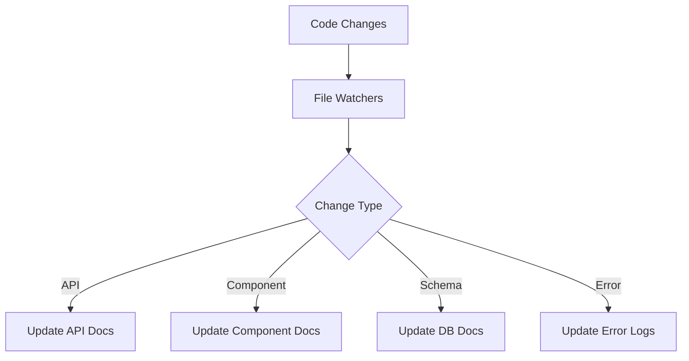
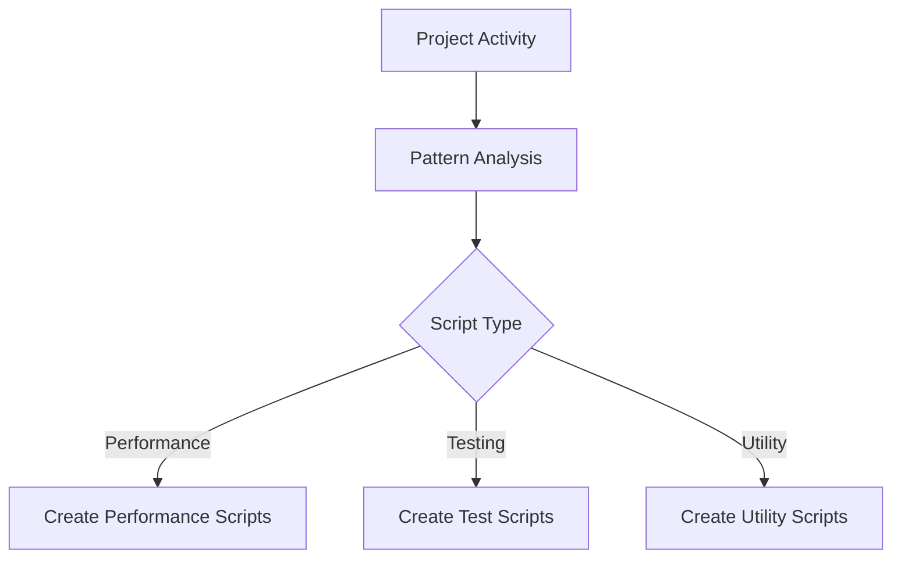
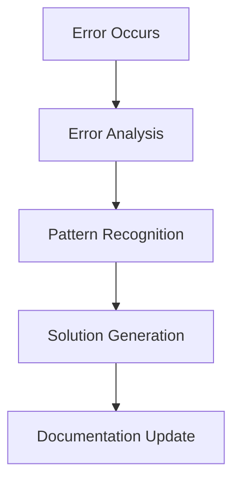

# 🤖 Project Automation & Documentation Guide

## 📚 Overview
This guide describes the automated systems that maintain, document, and optimize the Rate My Employer project. Our automation suite handles documentation updates, script generation, error tracking, and system health monitoring without manual intervention.

## 🎯 Design Philosophy
1. **Zero Manual Intervention**
   - Documentation stays current automatically
   - Scripts are generated based on patterns
   - Errors are tracked and documented
   - Solutions are automatically proposed

2. **Self-Improving**
   - Learns from development patterns
   - Adapts to team workflow
   - Evolves with the project
   - Optimizes based on usage

3. **Proactive, Not Reactive**
   - Anticipates common issues
   - Suggests optimizations
   - Prevents documentation drift
   - Maintains code health

## 🔄 Documentation Structure

### Core Documentation Files
```
docs/
├── PROJECT_GUIDE.md       # Main project documentation
├── SYSTEM_CHECKS.md       # Health monitoring and diagnostics
├── ERROR_SOLUTIONS.md     # Error tracking and solutions
├── AUTOMATION_GUIDE.md    # This file
└── DOCUMENTATION_HUB.md   # Entry point and navigation
```

### File Purposes

#### PROJECT_GUIDE.md
- Project overview
- Setup instructions
- Architecture details
- Development workflow
- Key features
- Best practices

#### SYSTEM_CHECKS.md
- Health check results
- Performance metrics
- Security audit logs
- Optimization suggestions

#### ERROR_SOLUTIONS.md
- Common error patterns
- Troubleshooting guides
- Solution database
- Prevention strategies

#### DOCUMENTATION_HUB.md
- Quick start guide
- Navigation hub
- Available commands
- Recent updates

## 🔄 Automation Systems

### 1. Documentation Automation
Automatically maintains all project documentation:



### 2. Script Generation
Creates and updates utility scripts based on project needs:



### 3. Error Management


## 🛠️ Implementation

### Base Configuration
```typescript
// scripts/auto-generate-config.ts
export const config = {
  documentation: {
    updateTriggers: ['commit', 'build', 'error'],
    templates: './resources/templates',
    output: './resources'
  },
  scripts: {
    generators: ['test', 'performance', 'utility'],
    output: './scripts',
    naming: 'kebab-case'
  }
}
```

### Git Hooks Integration
```bash
#!/bin/sh
# .husky/pre-commit

# Run documentation updates
npm run update-docs

# Add updated files
git add docs/*.md

# Run checks
npm run check
```

### CI/CD Integration
```yaml
name: Update Documentation
on:
  push:
    branches: [main]
  pull_request:
    branches: [main]

jobs:
  update-docs:
    runs-on: ubuntu-latest
    steps:
      - uses: actions/checkout@v2
      - name: Update Documentation
        run: |
          npm install
          npm run update-docs
      - name: Commit changes
        run: |
          git config user.name github-actions
          git config user.email github-actions@github.com
          git add docs/*.md
          git commit -m "docs: auto-update documentation" || echo "No changes"
          git push
```

## 📊 Monitoring & Reporting

### Health Metrics
- Documentation freshness
- Script coverage
- Error resolution rate
- System performance

### Automation Reports
- Weekly summaries
- Error patterns
- Performance trends
- Documentation updates

## 🔧 Best Practices

### Documentation
- Keep documentation atomic and focused
- Use clear, consistent formatting
- Include timestamps for updates
- Cross-reference related sections
- Maintain a clear hierarchy

### Automation
- Update only what changed
- Validate documentation after updates
- Keep history of changes
- Handle errors gracefully
- Log significant updates

### Content
- Use clear headings
- Include code examples
- Add troubleshooting tips
- Keep language consistent
- Update dependencies list

### Integration
- Run updates before commits
- Verify changes before pushing
- Maintain backup copies
- Handle conflicts gracefully
- Log all automation actions

## 🔜 Future Improvements
- [ ] AI-powered solution suggestions
- [ ] Visual documentation updates
- [ ] Real-time performance monitoring
- [ ] Advanced pattern recognition
- [ ] Team collaboration features

---

*This guide is automatically maintained by the project's automation system.*
*Last Updated: [Current Date]* 

## Testing Automation

### Test Runner Setup
```bash
# Run all tests
npm test

# Run tests with coverage
npm test -- --coverage

# Run tests in watch mode
npm test -- --watch

# Run specific test file
npm test -- path/to/test.tsx
```

### Coverage Reports
- Location: `coverage/lcov-report/index.html`
- Thresholds:
  ```javascript
  // jest.config.js
  module.exports = {
    coverageThreshold: {
      global: {
        statements: 70,
        branches: 70,
        functions: 70,
        lines: 70
      }
    }
  }
  ```

### Test Utilities
```typescript
// src/__tests__/utils/test-utils.tsx
import { render } from '@testing-library/react';
import { AuthProvider } from '@/contexts/AuthContext';

const AllTheProviders = ({ children }) => {
  return (
    <AuthProvider>
      {children}
    </AuthProvider>
  );
};

const customRender = (ui, options = {}) =>
  render(ui, { wrapper: AllTheProviders, ...options });

export * from '@testing-library/react';
export { customRender as render };
```

### Mocking Setup
```typescript
// src/__tests__/mocks/supabase.ts
export const mockSupabase = {
  auth: {
    onAuthStateChange: jest.fn().mockImplementation((callback) => {
      return { data: { subscription: { unsubscribe: jest.fn() } } };
    }),
    getSession: jest.fn().mockResolvedValue({ data: { session: null }, error: null }),
    getUser: jest.fn().mockResolvedValue({ data: { user: null }, error: null })
  },
  from: jest.fn(() => ({
    select: jest.fn(() => ({
      eq: jest.fn().mockResolvedValue({ data: [], error: null }),
      single: jest.fn().mockResolvedValue({ data: null, error: null })
    })),
    insert: jest.fn().mockResolvedValue({ data: null, error: null }),
    update: jest.fn().mockResolvedValue({ data: null, error: null }),
    delete: jest.fn().mockResolvedValue({ data: null, error: null })
  }))
};
```

## Type Generation

### Supabase Types
```bash
# Generate types from Supabase
npm run update-types

# Watch for schema changes
npm run update-types -- --watch
```

### Component Types
```typescript
// src/types/components.ts
export interface ReviewFormProps {
  companyId?: string | number;
  initialData?: Review;
  onSuccess?: () => void;
}

export interface CompanyCardProps {
  company: Company;
  showActions?: boolean;
}
```

## Database Automation

### Migrations
```bash
# Create new migration
npm run migration:create

# Apply migrations
npm run migration:up

# Rollback migration
npm run migration:down
```

### Seeding
```bash
# Seed database
npm run db:seed

# Reset database
npm run db:reset
```

## CI/CD Workflows

### Pull Request Checks
```yaml
name: PR Checks
on: [pull_request]

jobs:
  test:
    runs-on: ubuntu-latest
    steps:
      - uses: actions/checkout@v2
      - uses: actions/setup-node@v2
      - run: npm ci
      - run: npm run type-check
      - run: npm test -- --coverage
```

### Deployment
```yaml
name: Deploy
on:
  push:
    branches: [main]

jobs:
  deploy:
    runs-on: ubuntu-latest
    steps:
      - uses: actions/checkout@v2
      - uses: actions/setup-node@v2
      - run: npm ci
      - run: npm run build
      - run: npm run deploy
```

## Code Quality

### Linting
```bash
# Run ESLint
npm run lint

# Fix ESLint issues
npm run lint:fix

# Run Prettier
npm run format

# Check types
npm run type-check
```

### Git Hooks
```json
{
  "husky": {
    "hooks": {
      "pre-commit": "lint-staged",
      "pre-push": "npm test"
    }
  },
  "lint-staged": {
    "*.{ts,tsx}": [
      "eslint --fix",
      "prettier --write"
    ]
  }
}
```

## Development Workflow

### Setup
```bash
# Install dependencies
npm install

# Set up environment
cp .env.example .env.local

# Start development server
npm run dev
```

### Testing
```bash
# Run tests in watch mode
npm test -- --watch

# Update snapshots
npm test -- -u

# Run specific tests
npm test -- ReviewForm
```

### Building
```bash
# Build for production
npm run build

# Start production server
npm start
```

## Security Automation

### Authentication
```typescript
// src/middleware.ts
export { default } from "next-auth/middleware";

export const config = {
  matcher: ["/dashboard/:path*", "/settings/:path*"]
};
```

### API Protection
```typescript
// src/lib/auth.ts
export const getServerSession = async () => {
  const supabase = createClient();
  const { data: { session } } = await supabase.auth.getSession();
  return session;
};
```

## Performance Monitoring

### Metrics Collection
```typescript
// src/lib/analytics.ts
export const trackPageView = (url: string) => {
  // Implementation
};

export const trackEvent = (name: string, data: any) => {
  // Implementation
};
```

### Error Tracking
```typescript
// src/lib/error.ts
export const captureError = (error: Error) => {
  // Implementation
};
```

## Documentation

### API Documentation
```typescript
/**
 * @api {post} /api/reviews Create Review
 * @apiName CreateReview
 * @apiGroup Reviews
 * @apiVersion 1.0.0
 *
 * @apiParam {String} title Review title
 * @apiParam {String} content Review content
 * @apiParam {Number} rating Rating (1-5)
 * @apiParam {String} employment_status Employment status
 */
```

### Component Documentation
```typescript
/**
 * ReviewForm Component
 *
 * @component
 * @example
 * ```tsx
 * <ReviewForm companyId={1} onSuccess={() => {}} />
 * ```
 */
```

## Monitoring

### Health Checks
```typescript
// src/pages/api/health.ts
export default function handler(req, res) {
  res.status(200).json({ status: 'healthy' });
}
```

### Performance Metrics
```typescript
// src/lib/metrics.ts
export const measureTiming = async (name: string, fn: () => Promise<any>) => {
  const start = performance.now();
  const result = await fn();
  const duration = performance.now() - start;
  // Log duration
  return result;
};
```

## Deployment

### Environment Variables
```bash
# Production
NEXT_PUBLIC_SUPABASE_URL=
NEXT_PUBLIC_SUPABASE_ANON_KEY=

# Development
NEXT_PUBLIC_SUPABASE_URL=
NEXT_PUBLIC_SUPABASE_ANON_KEY=
```

### Build Configuration
```json
{
  "scripts": {
    "build": "next build",
    "start": "next start",
    "lint": "next lint",
    "test": "jest",
    "type-check": "tsc --noEmit"
  }
}
``` 

# Test Automation Guide

## Directory Structure
```
scripts/
├── test/                    # Test-related scripts
│   ├── setup.ts            # Sets up test environment and structure
│   └── fix.ts              # Fixes test files (imports, props, utilities)
├── verify-build.ts         # Build verification
├── get-schema.ts           # Database schema utilities
├── db-utils.ts            # Database utilities
└── ...                    # Other utility scripts
```

## Test Scripts

### 1. Test Setup (`npm run test:setup`)
- Creates test directory structure under `src/__tests__/`
- Sets up test utilities and mock files
- Organizes existing test files into appropriate directories
- Cleans up empty directories

Directory structure created:
```
src/__tests__/
├── components/            # Component tests
├── hooks/                # Hook tests
├── lib/                  # Library/utility tests
├── contexts/             # Context tests
├── utils/                # Test utilities
├── mocks/                # Mock data and services
├── integration/          # Integration tests
└── e2e/                  # End-to-end tests
```

### 2. Test Fixes (`npm run test:fix`)
Automatically fixes common issues in test files:
- Import statements
- Component props
- Test utilities
- Mock data imports

### 3. Combined Test Command (`npm run test:all`)
Runs the complete test suite:
1. Sets up test environment (`test:setup`)
2. Fixes test files (`test:fix`)
3. Runs tests (`test`)

## Test Utilities

### Mock Data
Located in `src/__tests__/mocks/`:
- `user.mock.ts` - User data
- `review.mock.ts` - Review data
- `company.mock.ts` - Company data

### Test Utils
Located in `src/__tests__/utils/`:
- `test-setup.ts` - Global test setup
- `test-utils.tsx` - Common test utilities
- `test-types.ts` - Test-specific types

## Usage Examples

### Setting Up Tests
```bash
# Full setup
npm run test:all

# Individual steps
npm run test:setup  # Setup only
npm run test:fix    # Fix issues only
npm run test       # Run tests only
```

### Writing Tests
```typescript
import { describe, it, expect } from 'vitest';
import { renderWithProviders } from '../utils/test-utils';
import { mockUser, mockReview, mockCompany } from '../mocks/mockData';

describe('Component Test', () => {
  it('should render correctly', () => {
    const { container } = renderWithProviders(
      <Component prop={mockData} />
    );
    expect(container).toBeInTheDocument();
  });
});
```

## Best Practices

1. **Test Organization**
   - Place tests in appropriate directories based on type
   - Use descriptive file names
   - Follow the established directory structure

2. **Mock Data**
   - Use centralized mock data from `mocks/` directory
   - Keep mock data minimal but sufficient
   - Use type-safe mock data

3. **Test Utilities**
   - Use `renderWithProviders` for components that need context
   - Import test utilities from centralized location
   - Follow established patterns for common operations

4. **Maintenance**
   - Run `npm run test:fix` after adding new tests
   - Keep mock data up to date with schema changes
   - Clean up unused test files and utilities

## Troubleshooting

### Common Issues

1. **Import Errors**
   ```bash
   npm run test:fix  # Fixes most import issues
   ```

2. **Missing Props**
   ```bash
   npm run test:fix  # Adds required props to components
   ```

3. **Test Environment Issues**
   ```bash
   npm run test:setup  # Resets test environment
   ```

### Getting Help
- Check the error logs in `resources/ERRORS_AND_SOLUTIONS.md`
- Run tests with debug flag: `npm run test:e2e:debug`
- Review test setup in `src/__tests__/utils/test-setup.ts` 

## 🧪 Test Organization

### Test File Structure
```
src/__tests__/
├── core.test.ts              # Core business logic tests
├── company-features.test.tsx # Company feature tests
├── review-features.test.tsx  # Review feature tests
├── ui.test.tsx              # UI component tests
├── integration.test.tsx     # Integration tests
├── setup.ts                 # Test setup and configuration
├── mocks/                   # Mock data and utilities
└── utils/                   # Test utilities
```

### Test Categories

#### 1. Core Business Logic Tests (`core.test.ts`)
- Authentication flows
- Database operations
- API endpoints
- Error handling

#### 2. Company Feature Tests (`company-features.test.tsx`)
- Company CRUD operations
- Company search and filtering
- Company reviews
- Company statistics

#### 3. Review Feature Tests (`review-features.test.tsx`)
- Review submission
- Review filtering
- Review likes
- Review management

#### 4. UI Component Tests (`ui.test.tsx`)
- Basic components (buttons, inputs)
- Navigation components
- Form components
- Card components

#### 5. Integration Tests (`integration.test.tsx`)
- End-to-end flows
- Cross-component interactions
- State management
- API integrations

### Test Utilities
- Mock data generation
- Test helpers
- Custom matchers
- Type definitions

### Running Tests
```bash
# Run all tests
npm test

# Run specific test file
npm test core.test.ts

# Run tests with coverage
npm test -- --coverage
``` 